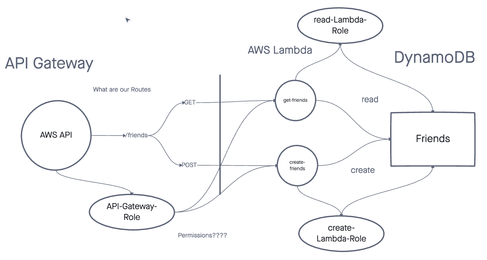

# serverless-api

## Author

Antoine Charette

## Problem Domain

In this lab, we were tasked with making a serverless API with a /people route. The CRUD for this lab was supposed to be GET, PUT, POST, and Delete.

## UML

## Routes

POST:

- Adds a person to the people table in dynamodb using dynamoose

GET:

- Gets one person using the parameter id specified by the client
- Gets all people from the table

PUT:

- Updates a person with a specific id

DELETE:

- Deletes a person with a specific id
